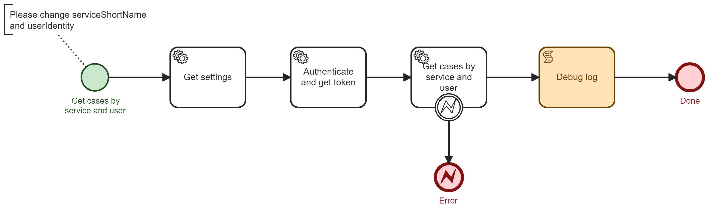

# Onify Blueprint: Get cases from Sokigo Abou

[Abou](https://sokigo.com/produkter/abou/), offered by [Sokigo](https://sokigo.com/), is a widely used e-service platform in Sweden. Abou enables you to create your own e-services or access ready-made e-services shared by other customers. The platform supports case handling either directly in Abou or through integration with other systems.

This Blueprint demonstrates how to get all cases based on service (`serviceShortName`) and user (`userIdentity`) via Abou:s REST API.

> Note: We are using token-based authentication (recommended) for Abou:s REST API.

## Requirements

These are the technical requirements.

* [Onify Hub](https://github.com/onify/install)
* [Onify Hub Functions](https://github.com/onify/hub-functions)
* [Camunda Modeler](https://camunda.com/download/modeler/)
* [Abou](https://sokigo.com/produkter/abou/)

## Setup

### Abou

To make calls to the Abou API, API users are required, which are administered in the Abou Admin Interface. Token-based authentication means that before making actual API calls, a time-limited token (an encrypted "key" based on JWT, Json Web Token) must be obtained, which then must be included with every API call in the form of a Bearer Authorization Header.

> Note: The user also need access for the selected service.

### Onify

Add the following settings in Onify.

|Key|Value|Type|Tag|Role|
|---|-----|----|---|----|
|abou_url|`***` (eg. `https://services.minkommun.se`)|string|abou||
|abou_username|`***` (eg. `onify`)|string|abou|admin|
|abou_apikey|`***`|password|abou|admin|

> Note: Creating settings via admin interface add a trailing `_` in key. This is required for flow to work.

## Test

1. Open the BPMN diagram in Camunda Modeler.
2. Deploy the BPMN diagram (click `Deploy current diagram` and follow the steps).
3. Run it (click `Start current diagram`).

## Support

* Community/forum: https://support.onify.co/discuss
* Documentation: https://support.onify.co/docs
* Support and SLA: https://support.onify.co/docs/get-support

## License

This project is licensed under the MIT License - see the [LICENSE](LICENSE) file for details.